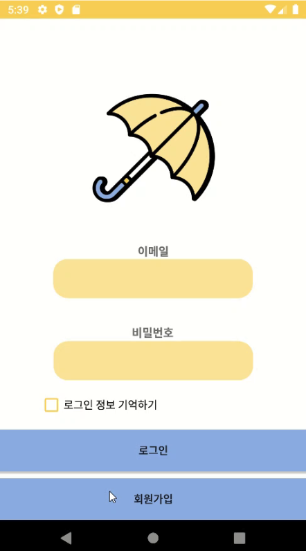
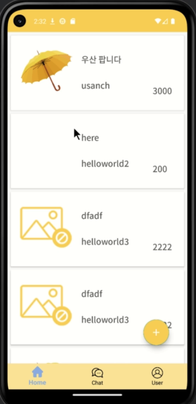
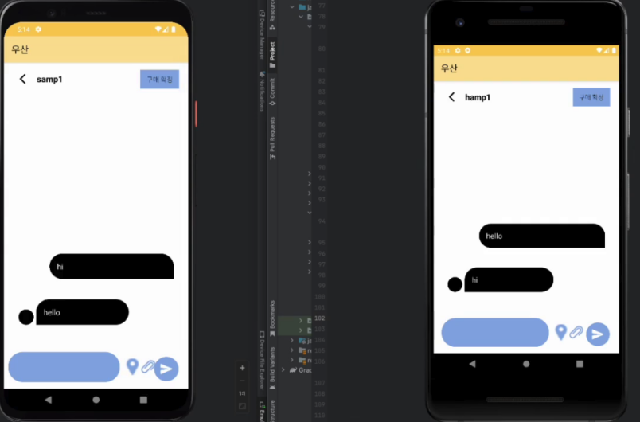
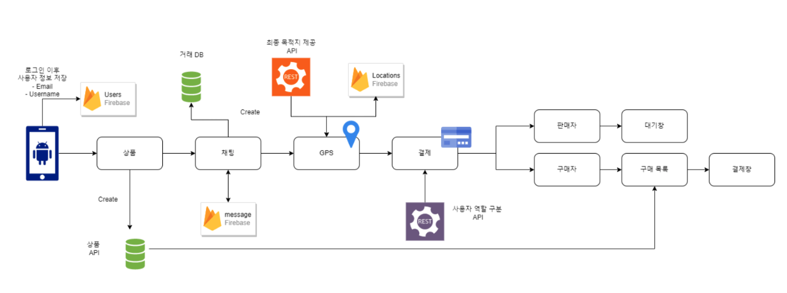

# USan

GPS 기반 중고거래 플랫폼입니다. 오프라인 거래 시 구매자와 판매자가 일정 범위 내에 있으면 결제를 수행할 수 있습니다.

## 사용 화면

|   사용 화면 |   중고거래 목록 |   채팅 화면 |
| --------------------------------------------- | ------------------------------------------------------ | -------------------------------------- |

## 기술 스택

- JAVA
- Android Studio
- Python == 3.9.16
- Flask == 2.2.3
- Firebase

## 아키텍쳐

## 기능

- 사용자
- 상품
- 채팅
- GPS
- 결제([오픈 뱅킹 API 테스트베드 활용](https://developers.kftc.or.kr/dev))

> [!TIP]
> 자세한 내용은 [슬라이드](./slides/우산-최종%20발표%20자료.pdf)를 확인해주시기 바랍니다.
